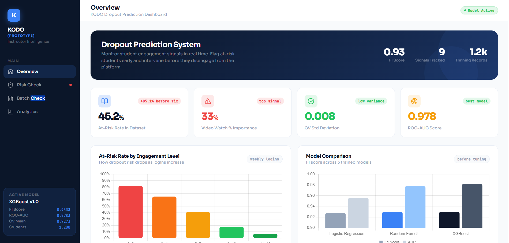
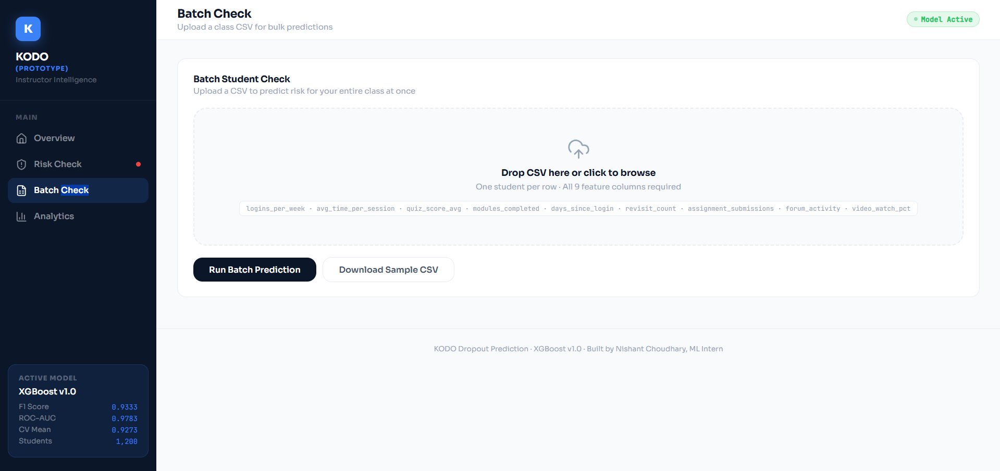
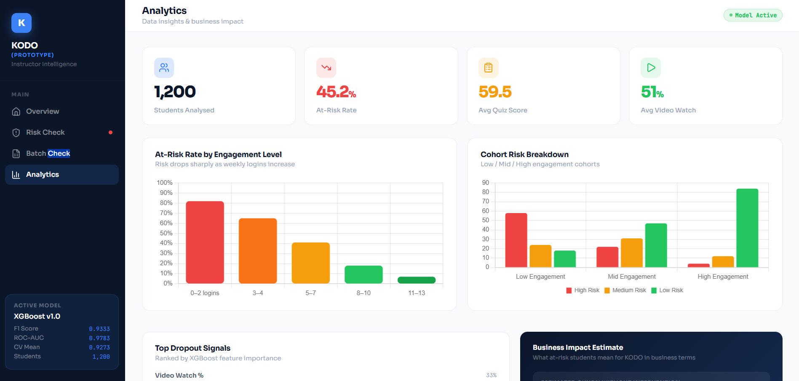
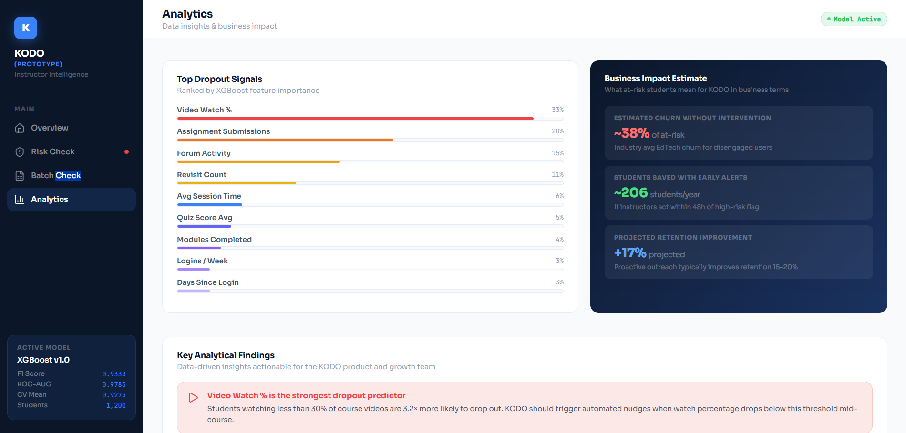
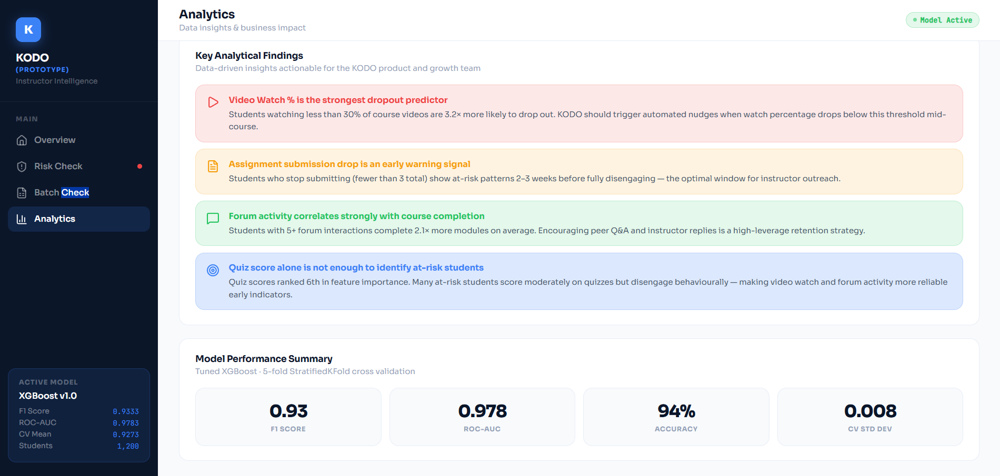
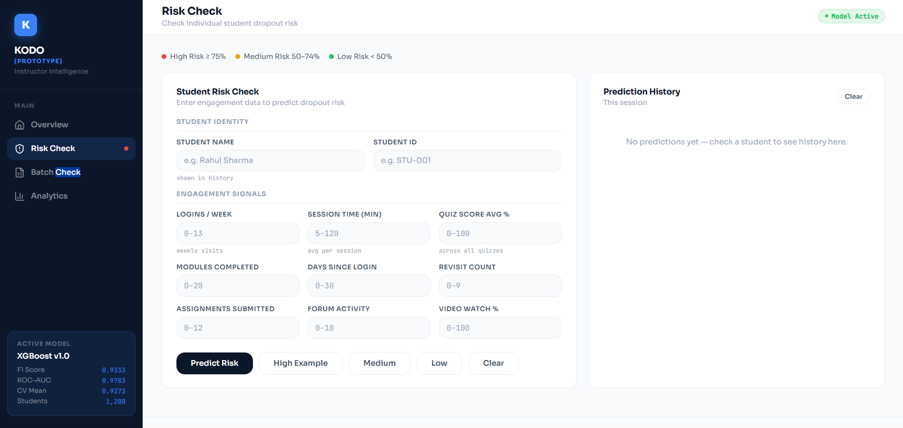

# 🎓 KODO — Student Dropout Prediction System

**Prototype ML system inspired by work completed during internship at KODO (Nov 2025 – Feb 2026)**

*Monitor student engagement. Flag at-risk students early. Give instructors the window to intervene before it's too late.*

---

# 🔒 Prototype & Confidentiality Notice

> **Important:** This repository is **not the actual production system built during my internship at KODO.**
> Due to company confidentiality policies and internship agreements, I cannot publicly share proprietary code, real datasets, internal architecture, or deployment details from the original project.
>
> This repository is a **personal prototype recreation** developed independently to demonstrate:
> - The problem statement I worked on.
> - My machine learning workflow and thought process.
> - Dashboard design and prediction pipeline concepts.
> - End-to-end implementation skills using synthetic data.
>
> All datasets used here are **synthetically generated** and do **not contain any real student or company data.**
> The UI, metrics, workflows, and business insights are adapted solely for portfolio and educational purposes.
>
> The original internship project involved significantly more internal infrastructure, production integrations, and proprietary implementation details that are intentionally excluded from this public version.

---

## 📸 Dashboard Preview

### Overview — Dropout Prediction Dashboard

> Live model stats, at-risk rate by engagement level, and model comparison across Logistic Regression, Random Forest, and XGBoost.

### Analytics — Top Dropout Signals & Business Impact

> XGBoost feature importance ranked — Video Watch % dominates at 33%. Business impact estimates show ~206 students saved per year with early alerts.

### Analytics — Engagement Cohorts & Risk Breakdown

> At-risk rate drops sharply as weekly logins increase. Cohort breakdown shows High / Medium / Low risk distribution across engagement groups.

### Analytics — Key Findings & Model Performance

> Four data-driven insights for the product team, plus model performance summary: F1 0.93, ROC-AUC 0.978, Accuracy 94%, CV Std Dev 0.008.

### Risk Check — Individual Student Prediction

> Instructors enter 9 engagement signals for a student and get an instant risk prediction with session history tracking.

### Batch Check — Class-Wide CSV Upload

> Upload a full class CSV and run bulk predictions in one click. Exports results, filters by risk level, and shows donut chart breakdown.

---

## 🧠 What Is This?

KODO is a study platform where students take courses, submit assignments, watch videos, and interact with instructors through forums.

During my internship at KODO, I worked on student engagement and dropout prediction concepts. Since the original implementation and datasets are confidential, this repository presents a prototype recreation built with synthetic data to demonstrate the overall approach and workflow.

The goal of this prototype is to simulate how instructors could identify students showing early signs of disengagement and intervene before dropout occurs.

---

## 🔴 The Problem

Instructors on KODO were checking student progress manually — which doesn't scale. A single instructor managing 100+ students can't individually monitor who is going inactive, struggling with quizzes, or hasn't submitted assignments in weeks.

The goal: **automate this.** Flag students showing early dropout signals so instructors can intervene at the optimal window — 2–3 weeks before full disengagement.

---

## 🚀 Live Demo

> **Dashboard:** *(add your Render URL here after deployment)*
> **API:** *(add your Render API URL here)*

---

## ⚙️ What I Built

### 1. Data Pipeline

To respect company confidentiality policies, this prototype uses **synthetically generated student engagement data** designed to mimic realistic platform behaviour — **1,200 students, 9 features each.**

| Feature | What It Captures |
|---|---|
| `logins_per_week` | How often the student visits the platform |
| `avg_time_per_session` | How long they stay per visit |
| `quiz_score_avg` | Average score across all quizzes |
| `modules_completed` | How many course modules finished |
| `days_since_login` | Days since last login |
| `revisit_count` | How often they review old content |
| `assignment_submissions` | Assignments submitted |
| `forum_activity` | Posts and replies in forums |
| `video_watch_pct` | Percentage of course videos watched |

A student is flagged **at risk** if they match any of:
- Quiz average below 40%
- Inactive 15+ days AND fewer than 8 modules completed
- Logins < 2/week AND submissions < 3 AND video watch < 30%

---

### 2. Model Training

Trained and compared 3 models — **Logistic Regression**, **Random Forest**, and **XGBoost**.

**Pipeline:**
- SMOTE to fix class imbalance (training data only — never test)
- StandardScaler for feature scaling
- GridSearchCV with 5-fold StratifiedKFold cross validation
- 108 hyperparameter combinations tested

**Final Results — Tuned XGBoost:**

| Metric | Score |
|---|---|
| F1 Score | **0.93** |
| ROC-AUC | **0.978** |
| CV Mean F1 | **0.9273** |
| CV Std Dev | **0.0081** |
| Accuracy | **94%** |

> These metrics are based on synthetic data and are intended to demonstrate the ML workflow and modelling approach rather than real-world production performance.

---
